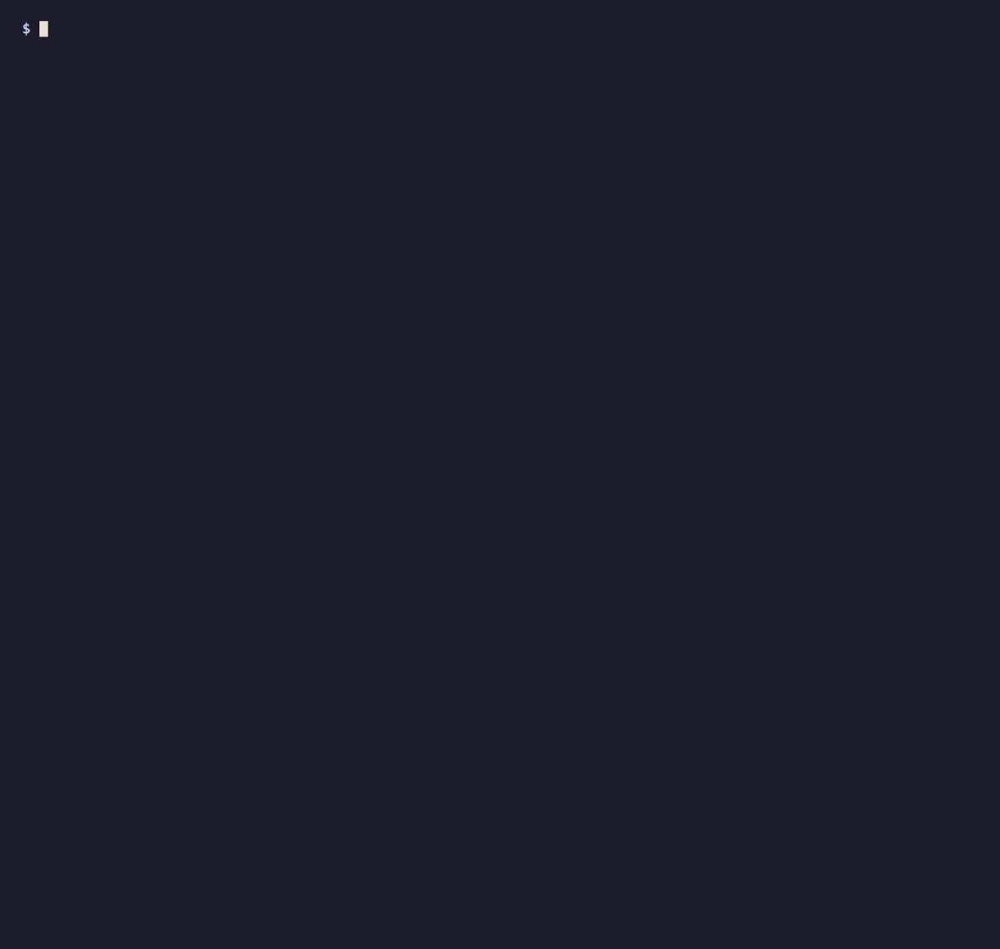

# blindgrid

[](https://github.com/adrnbttr/blindgrid/actions/workflows/ci.yml)
[](https://www.python.org/downloads/)
[](LICENSE)

Generate lottery grids from cryptographic randomness, and plan a month of draws
inside a budget you cannot exceed.



## What this is

A small CLI that answers two questions once a month:

- **Which draws should I play?** Given a budget and a set of lotteries, it
  allocates the money by weight, picks real calendar dates at random, and
  stops. No pattern, no habit, no "I always play on Saturdays".
- **Which numbers?** Drawn from `secrets.SystemRandom`, then filtered against a
  handful of anti-pattern rules so the grid does not look like something a
  human would have chosen.

The plan is printed as a table and exported to a Markdown file.

## What this is not

**It does not predict anything, and it never will.** Lottery draws are
independent events. The numbers drawn last week carry no information about next
week's draw; a number that has not come up in two years is not "due". This is
not an opinion about lotteries, it is what independence means.

So the following are permanently out of scope, and pull requests adding them
will be declined:

| Not here | Why |
| --- | --- |
| Historical draw data, frequency statistics, hot/cold numbers | Past draws say nothing about future ones. Displaying them implies otherwise. |
| A `--seed` flag or any deterministic mode | Reproducible numbers reintroduce exactly the structure this tool removes. |
| Stored history of generated grids | Keeping grids invites comparing them to results, and comparing invites pattern-hunting. |
| Any attempt to spend the budget exactly | Unspent money is a good outcome. A tool that consumed the envelope would encourage spending. |

What is left, then? Two honest things: **randomness without human bias**, and a
**budget ceiling that does not move**.

### Why filter the numbers at all, if every combination is equally likely?

Because the *payout* is not equally likely. Every combination has the same
probability of being drawn, but combinations humans favour — birthdates below
32, sequences, neat patterns — are picked by thousands of other players at the
same time. When such a combination wins, the jackpot is split. Filtering does
not improve your odds of winning; it improves what you would receive if you
did.

The rule set stays deliberately small for the same reason. Every additional
rule shrinks the sample space, and a heavily filtered "random" pick is just a
different kind of predictable.

## Install

Requires Python 3.11 or later.

```bash
pipx install git+https://github.com/adrnbttr/blindgrid.git
```

Or from a clone, for development:

```bash
git clone https://github.com/adrnbttr/blindgrid.git
cd blindgrid
uv venv && uv pip install -e ".[dev]"
```

## Use

```bash
blindgrid config init      # create config.toml from the shipped example
blindgrid generate         # plan the current month
```

`generate` asks for two things — the budget for this month, and which lotteries
to include — then prints the plan and writes `plan.md`.

```
Usage: blindgrid [OPTIONS] COMMAND [ARGS]...

  generate    Build this month's plan: how much to spend, which draws, which numbers.
  config      Inspect and edit the configuration.
  lottery     Manage lottery definitions.
  version     Print the installed version.
```

Useful options on `generate`:

| Option | Effect |
| --- | --- |
| `-b, --budget 30` | Skip the prompt and use this amount. |
| `-l, --lottery Loto` | Include a specific lottery. Repeatable. |
| `-m, --month 2026-09` | Plan a month other than the current one. |
| `--no-export` | Print the plan without writing `plan.md`. |

## Configuration

Two files:

- `config.example.toml` — versioned, three French games as an illustration.
- `config.toml` — yours, gitignored, holding your own ceiling.

The ceiling is the point of the file:

```toml
max_monthly_budget = 40.00
```

`generate` refuses any budget above it. There is no override flag. A cap you
can raise in the moment while looking at a jackpot headline is not a cap.

### Adding a lottery from any country

Nothing in the code knows about France, or about any specific game. A lottery
is a price, a set of draw days, and one or more pools of numbers. That is the
whole model, and it covers every draw-style lottery I am aware of.

Here is the US **Powerball** — five numbers from 69, plus one from 26, drawn on
Mondays, Wednesdays and Saturdays at $2 a play:

```toml
[[lottery]]
label = "Powerball"
currency = "USD"
price_per_grid = 2.00
draw_days = ["monday", "wednesday", "saturday"]
weight = 1.0

  [[lottery.pool]]
  name = "numbers"
  count = 5
  max = 69

  [[lottery.pool]]
  name = "powerball"
  count = 1
  max = 26
```

Drop that into `config.toml` and it works. Or run `blindgrid lottery add` and
answer the prompts.

The filters adapt on their own: the 1-from-26 Powerball pool is too small for a
parity or spread rule to mean anything, so those rules switch themselves off
for it rather than searching forever for a combination that cannot exist.

### Weights

Weights are relative shares of one envelope, not draw counts.

```toml
weight = 1.0   # EuroMillions
weight = 1.0   # Loto
weight = 0.4   # EuroDreams — played, but a smaller slice
weight = 0.0   # disabled, without deleting the definition
```

With a €40 budget and those weights, EuroMillions and Loto receive €16.66 each
and EuroDreams €6.66. Each share then buys as many grids as it can afford, and
**the leftover in each share stays unspent**. It is never pooled, never
redistributed, never rounded up into one more grid.

If a share cannot cover a single grid, that lottery is skipped for the month
and the output says so explicitly. It never borrows from another share to make
itself viable.

## The randomness

Every number comes from `secrets.SystemRandom`, which draws from the operating
system's entropy pool. The `random` module is not imported anywhere in the
package — its Mersenne Twister is seedable and reproducible, which is a
liability here — and a test enforces that.

The same source picks which dates to play, because a schedule chosen by habit
is as predictable as numbers chosen by birthdate.

## Development

```bash
uv pip install -e ".[dev]"
pytest
ruff check .
ruff format --check .
```

CI runs both on Python 3.11, 3.12 and 3.13.

## Responsible gambling

This tool exists because a budget written down and capped is better than a
budget decided in the moment. It does not make gambling profitable. Over any
meaningful number of draws, the expected return of a lottery ticket is
negative — that is how lotteries fund themselves — and no arrangement of
numbers changes that.

Play with money you have already decided to lose. If gambling has stopped being
a small monthly cost and started being something else, these services are free
and confidential:

- **France** — Joueurs Info Service, 09 74 75 13 13, <https://www.joueurs-info-service.fr>
- **United Kingdom** — GamCare, 0808 8020 133, <https://www.gamcare.org.uk>
- **United States** — 1-800-GAMBLER, <https://www.ncpgambling.org>
- **International** — <https://www.gamblingtherapy.org>

## License

MIT — see [LICENSE](LICENSE).
